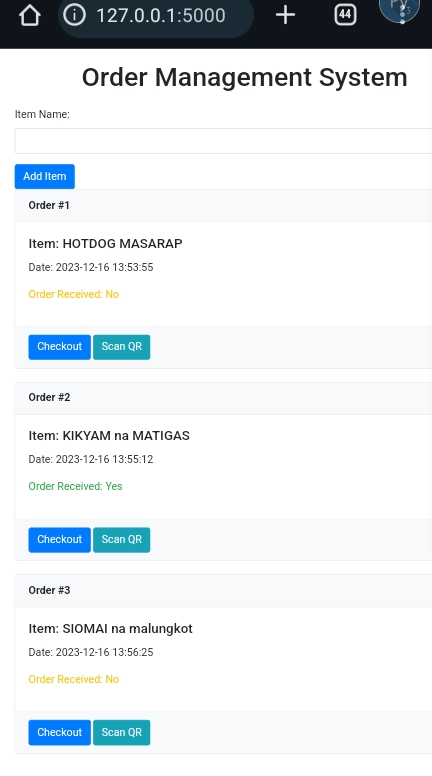
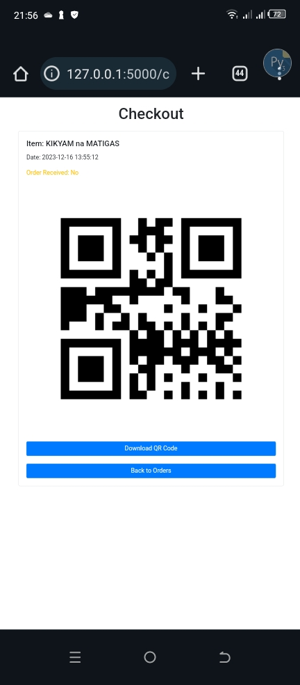

# Order Management System with QR Code Integration

The Order Management System with QR Code Integration is a web application designed to streamline the process of managing and tracking orders for businesses. This system leverages QR codes to provide a convenient and efficient way to identify and verify orders during the delivery process.

## Key Features

  **• Item Management:** Users can easily add items to their cart, creating a seamless shopping experience.

 **• Checkout and QR Code Generation:** Upon checkout, a unique QR code is generated for each order, encapsulating essential order details.

 **• Order Tracking:** The system allows users to track the status of their orders, indicating whether an order has been received or not.

 **• QR Code Scanner:** A dedicated QR code scanner page enables users to scan QR codes upon order delivery. Successful scanning updates the order status to "Received."

## Getting Started

### Prerequisites

- Python 3
- Git

### Installation

1. **Clone the repository:**

```bash
git clone https://github.com/DANZPH/order-management-system.git
```
2. Navigate to the project directory:
```bash
cd order-management-system
```
3. Install the required dependencies:
```bash
pip install -r requirements.txt
```
**Usage:**
Run the application:
```bash
python app.py
```
Open your web browser and visit http://127.0.0.1:5000.
for portforwarding I recommend ngrok
Visit the official [Ngrok](https://ngrok.com/) website for more information.

## Libraries and Technologies Used

- **Flask:** A powerful Python web framework for building robust and scalable web applications.

- **Flask-SQLAlchemy:** An extension for Flask that simplifies database operations by integrating with SQLAlchemy, a popular SQL toolkit and Object-Relational Mapping (ORM) library.

- **qrcode:** A Python library that facilitates the generation of QR codes, providing a quick and efficient way to encode information into QR code format.

- **QuaggaJS:** A versatile JavaScript library designed for decoding QR codes from live camera streams, enabling seamless QR code scanning in web applications.

## Structure
/OrderManagementSystem
 ├── app.py
 ├── models.py
 ├── scanner.py
 ├── templates/
 │   ├── add_item.html
 │   ├── checkout.html
 │   ├── index.html
 │   └── scanner.html
 ├── static/
 │   ├── qrcodes/
 │   └── styles.css
 ├── data/
 ├── README.md
 └── requirements.txt

## Contributing

Contributions are highly encouraged! Whether you have suggestions, bug reports, or new features to propose, please feel free to submit a pull request. Your input is invaluable in improving the functionality and user experience of the Order Management System.
## Screenshot




## License
This project is licensed under the [MIT License](LICENSE).
